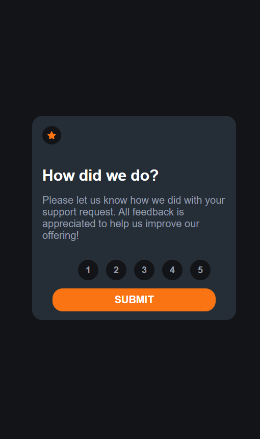

# Avaliação Interativa

# Objetivo do Projeto

Meu objetivo nesse projeto foi, aplicar o uso de JavaScript tentando desenvolver e internalizar mais o conhecimento na linguagem.

# Tecnologias

* JavaScript
* HTML5
* CSS3

# Imagens do Projeto

# Link para visualizar projeto no navegador
https://rodrigobarros2802.github.io/avaliacao-interativa/
